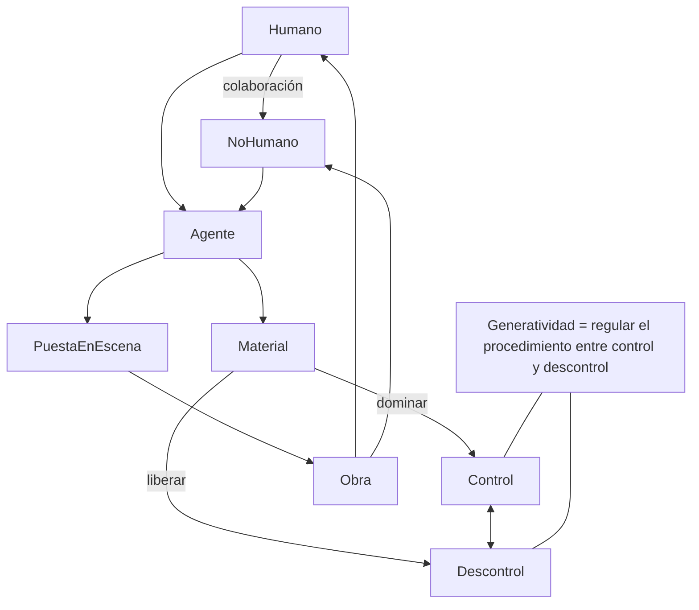
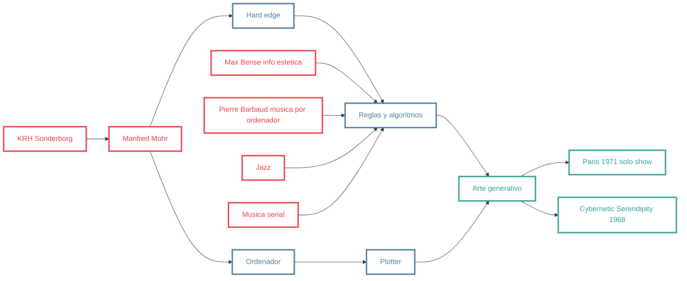
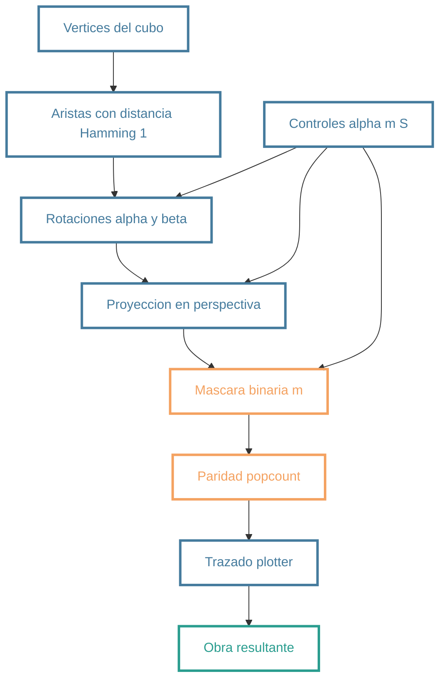

%% first slide
<grid drag="60 55" drop="5 10" bg="transparent" align="left">
# <clase titulo>
## Clase <Nro>
</grid>

<grid drag="25 55" drop="-5 10" bg="black" align="top">
-  tema1 <br>
- tema2 <br>
</grid>

<grid drag="-5 10" drop="5 -10" bg="black">
  
</grid>

<grid drag="80 10" drop="12 -12">
<b>Ciencia y Música</b> 900 | 2025 | Luciano Azzigotti</grid>


%% iconic writing template

$$
\newcommand{\mat}{\blacksquare}
\newcommand{\obj}{\blacklozenge}
\newcommand{\agn}{\bullet}
\newcommand{\itf}{\leftrightarrow}
\newcommand{\ent}[1]{\boxed{#1}}
\newcommand{\branch}{\twoheadrightarrow}
$$


---

## Interacción en clase (test)

```eval
id: poll-claridad
type: poll
mode: classtime
prompt: "¿Qué tan claro quedó el eje generatividad/complejidad hasta acá?"
options:
  - Claro
  - Parcialmente claro
  - Necesito repaso
anonymous: false
time: true
durationMinutes: 1
showResults: true
```

---


## Interacción en clase (wordcloud test)

```eval
id: wordcloud-org
type: wordcloud
mode: classtime
prompt: "¿Qué palabra te llevas de esta clase de organología?"
options:
  - Timbre
  - Resonancia
  - Materialidad
  - Clasificación
  - Acústica
anonymous: false
time: true
durationMinutes: 1
showResults: true
```

---


note: Este texto anuncia la inauguración en Buenos Aires de la exposición de obras de [[arte Conceptual]] organizada por la artista, activista y crítica Lucy Lippard y Jorge Glusberg. La inauguración tuvo lugar el 4 de diciembre de 1970, en las instalaciones del [[CAYC]], y la exposición presentó un panorama del movimiento conceptual, con obras de los principales artistas conceptuales del panorama internacional del momento. Glusberg, que firma el texto, nombra las principales características del movimiento y lo sitúa, a su manera particular, en la categoría de arte de sistemas, aunque esta categoría no se mencione en el documento. 

---


CAYC

---


 Laberinto para ratones blancos I, de Luis Fernando Benedit. 1971. Plexiglás, acetato, vidrio y siete ratones blancos, 27 x 44 x 22 cm. (Cortesía de Julian Benedit; fotografía de Pedro Roth).

note: Entre 1968 y 1972, el artista argentino Luis Fernando Benedit (1937-2011) realizó una serie de obras que años más tarde el crítico de arte Jorge Glusberg definiría como «experiencias físico-químicas biológicas».¹ En estas obras, Benedit incluía plantas, animales e incluso seres humanos, presentándolos como habitantes vivos de los entornos que él mismo construía. Las instalaciones no fueron creadas por el artista simplemente como experimentos empíricos para observar el comportamiento de sus «participantes». También fueron concebidas para poner en práctica una especie de «antropofuguismo», término acuñado por el escritor Julio Cortázar más de dos décadas después. Este concepto se traduce aproximadamente como «antropoescapismo», una perspectiva que, en oposición al antropocentrismo, desplaza la centralidad de los seres humanos en favor de los seres no humanos.

---

Prototipo para Laberinto para cucarachas, de Luis Fernando Benedit. 1972. Tinta sobre heliógrafo, 46 x 64,5 cm. (Cortesía de Julian Benedit).

---


Gota de agua, de Luis Fernando Benedit. 1971. 
Plexiglás, polietileno y agua, 44 x 25 x 25 cm. (Museo de Arte Blanton, Universidad de Texas en Austin; cortesía de Julian Benedit).

---


Diagrama de trabajo para Laberinto para ratones blancos II, de Luis Fernando Benedit. 1970. Tinta y acuarela sobre papel, 50 x 60 cm. (Cortesía de Julian Benedit).

---

 Vista de la instalación Laberinto invisible, de Luis Fernando Benedit. Alarma electrónica, lámpara de 150 vatios, siete espejos planos, un espejo cóncavo, acero inoxidable, ajolote mexicano, dimensiones variables. (Exposición en la Galería Faria Henrique, Nueva York, del 2 al 29 de febrero de 2011).
 
---

# CHECK TEACHER NOTES


_El arte generativo se refiere a cualquier práctica de la técnica donde el artista utiliza un sistema, probado como un conjunto de reglas de lenguaje natural, un programa de ordenador, una máquina, o otra invención de procedimiento, todo lo cual se pone en movimiento con un cierto grado de autonomía que contribuye a o resultante en una obra de arte completa.

note: 
Philip Galanter es un artista y teórico interesado en sistemas complejos y en la interconexión entre ciencia y humanidad.

Según Galanter, el arte generativo es una práctica donde los variados resultados pueden provenir utilizando un mismo de sistema generativo, donde la complejidad, orden y desorden son los principios organizativos de estos sistemas.

Entonces, aquí la importancia está en el sistema al cual el artista cede su total o parcial control.

---

# NIVEL 1

---

##  NIVEL 2

---


# MERMAID TEST

---




note:
Para Soolas, compartiendo la definición de arte generativo de Galanter, expresa que es una colaboración creativa entre un artista humano y un agente no humano, siendo consciente del problema de conjunción y frontera entre lo "humano" y lo "no‐humano".

Aquí Soolas señala entonces la posibilidad de que todo material es en un sentido autómomo y que todo artista entra en relación con esa "voluntad". La diferencia está entre la intención de dominar esa voluntad y la de liberarla: "es decir, de trabajar contra o con el material, de concebir esa relación como una lucha o como una colaboración."

---

## Manfred Mohr


---

test manfred dataviewjs


```dataviewjs
async () => {
  const W= Math.min(window.innerWidth*0.9, 680), H = W*0.66;
  const wrap=this.container.createEl('div'); wrap.style.margin='8px 0';
  const ui=this.container.createEl('div'); ui.style.marginBottom='6px'; ui.style.display='flex'; ui.style.gap='8px'; ui.style.alignItems='center';

  function mkSlider(min,max,val,step=1,label=''){
    const s=wrap.createEl('input');
    s.type='range'; s.min=min; s.max=max; s.step=step; s.value=val; s.style.width='160px';
    const l=wrap.createEl('span',{text:`${label}${val}`});
    l.style.fontFamily='ui-monospace'; l.style.marginLeft='6px';
    return {s,l};
  }

  const {s:ang,l:lAng}=mkSlider(0,360,25,1,'áng°=');
  const {s:mask,l:lMask}=mkSlider(0,255,85,1,'máscara=');
  const {s:scale,l:lScale}=mkSlider(40,160,120,1,'escala=');
  ui.append(ang,lAng,mask,lMask,scale,lScale);

  const c=this.container.createEl('canvas'); c.width=W; c.height=H;
  c.style.background='#fff'; c.style.boxShadow='0 0 0 1px #0002 inset';
  this.container.append(ui,c);

  function rot(v,a){
    const ca=Math.cos(a), sa=Math.sin(a);
    let [x,y,z]=v; let x1= x*ca - y*sa, y1= x*sa + y*ca, z1=z;
    const cb=Math.cos(a*0.7), sb=Math.sin(a*0.7);
    let x2= x1*cb - z1*sb, z2= x1*sb + z1*cb;
    return [x2,y1,z2];
  }
  function proj([x,y,z], s){ const p=1/(1+0.8*z); return [W/2 + s*x*p, H/2 + s*y*p]; }

  const verts=[]; for(let i=0;i<8;i++){ verts.push([ (i&1)?1:-1, (i&2)?1:-1, (i&4)?1:-1 ]); }
  const edges=[]; for(let i=0;i<8;i++)for(let j=i+1;j<8;j++){
    const d=((i^j).toString(2).match(/1/g)||[]).length;
    if(d===1) edges.push([i,j]);
  }

  const ctx=c.getContext('2d');
  function draw(){
    ctx.clearRect(0,0,W,H); ctx.fillStyle='#fff'; ctx.fillRect(0,0,W,H);
    ctx.strokeStyle='#111'; ctx.lineWidth=1;
    const a=ang.value*Math.PI/180, s=+scale.value, m=+mask.value;
    const V=verts.map(v=>rot(v,a));
    const Z=V.map(v=>v[2]); const order=[...Array(8).keys()].sort((i,j)=>Z[i]-Z[j]);
    for(const [i,j] of edges){
      const bit=((i^j)&m);
      if((bit.toString(2).match(/1/g)||[]).length%2===1){
        const p1=proj(V[i],s), p2=proj(V[j],s);
        ctx.beginPath(); ctx.moveTo(...p1); ctx.lineTo(...p2); ctx.stroke();
      }
    }
    lAng.textContent='áng°='+ang.value;
    lMask.textContent='máscara='+mask.value;
    lScale.textContent='escala='+scale.value;
  }
  [ang,mask,scale].forEach(s=>s.oninput=draw); draw();
}
```

---


P-197 J, 1979
Acrylic on canvas
135 x 135 cm
Acquired in 1996

note: Desde 1969, Manfred Mohr utiliza ordenadores y trazadores como ayudas electrónicas y digitales para el dibujo, lo que hace inevitable que el proceso creativo se convierta en uno lógico. En palabras del propio Mohr, «los gráficos por ordenador... son el producto de problemas definidos de forma inequívoca, con el análisis detallado del proceso de programación que antes permanecía oculto como si fuera un tabú». (M.M.) En el grupo de trabajo Divisibility, que forma parte de la serie Generative Arbeiten [Obras generativas], a la que pertenece la obra P-306-K, Mohr investiga el carácter superficial de los signos creados según reglas definidas por el artista: «El cubo se divide en cuatro partes mediante una incisión horizontal y otra vertical. Se proyectan cuatro rotaciones independientes de un cubo en los cuadrantes correspondientes producidos por las incisiones. Para que los signos sean visualmente estables, dos cuadrantes diagonalmente opuestos contienen la misma rotación» (M.M.). Sin embargo, P-197 J hace transparente el principio sistemático, a través de la serialidad variable y el patrón estructural.


---

### TEST LISTA 
- Intuición: la materia “responde” con una suerte de voluntad propia (resistencias, regularidades, ruido).
- El gesto del artista no domina por completo; conversa con esa voluntad.
- Objetivo: pasar de “imposición de forma” a cooperación con reglas del material/proceso.

---

### Max Bense (1910–1990)


-  estética de la información, claridad formal, reglas explícitas)

note: 
 Estética de Max Bense, donde él intenta formalizar la teoría de lo bello usando lógica matemática y diagramas. Te lo explico en 5 puntos clave para que quede claro:

---

1. Elementos básicos

Bense distingue entre tres dimensiones:
- R (Realidad): lo que efectivamente está dado en el objeto.
- Cᵣ (Correalidad): lo que acompaña a la realidad, como contexto, asociación o ampliación.
- N (Necesidad): lo que estructura, lo que debe estar para que algo tenga forma coherente.
- P (Posibilidad): el campo total de lo que puede configurarse.

2. Tres tipos de “bello”

Bense aplica estas categorías para definir distintos modos de lo bello:
- Bello artístico (Bₐ) → es el resultado de la interacción entre lo real y la correalidad bajo la mediación de la posibilidad.
- Bello técnico (Bₜ) → surge cuando la necesidad cubre a la correalidad: lo que está técnicamente resuelto y se percibe como belleza en el ajuste formal.
- Bello natural (Bₙ) → se entiende como la suma directa de lo real y lo correal, sin mediación artificial.

3. Representación gráfica

Los rectángulos muestran cómo se distribuyen los campos (R, Cᵣ, N, P).
- En el bello técnico, N (necesidad) está dentro de P (posibilidad) y cubre a Cᵣ (correalidad).
- En el bello natural, simplemente se yuxtaponen R y Cᵣ.
- En el bello artístico, hay un juego lógico más complejo (R + [Cᵣ·N’])·P, donde se incluye la copresencia de lo real, lo correal y la negación de la necesidad.

4. Formalización booleana

Usando el álgebra de Boole, Bense traduce relaciones estéticas en fórmulas:
- Bₐ = (R + [Cᵣ·N’])·P
- Bₜ = (R + [Cᵣ’’N])·P
- Bₙ = R + Cᵣ
Esto significa que la estética no es un “misterio”, sino una combinación de factores lógicos y mensurables.

---

## TEST LILYPOND 

```lily
\version "2.24.0" % Specify your LilyPond version
\paper { 
tagline = ##f  
paper-height=#(* 2 cm) 
paper-width=#(* 20 cm)  
system-count=#1 }

\score {
\new Staff \relative{c'4 d e f g}
}
```

---

# TEST MATHJAX

$$
E = H - R
$$

donde:
- $H$ = entropía (variedad, sorpresa, complejidad informacional)
- $R$ = redundancia (regularidad, repetición, previsibilidad)
- $E$ = valor estético como equilibrio entre ambas.

- Vértices: $V=\{-1,1\}^3,\ |V|=8.$

$$
P(x) = e^{-\lambda x}
$$
define la probabilidad de que una cierta duración o intervalo ocurra, en lugar de fijarlo nota por nota.


---

## TEST LINKS

[[Manfred Mohr]]

---

Elección de una primera “fórmula” (ejemplo didáctico)
- Grafo del cubo en 3D:

- Aristas: dos vértices conectan si su distancia de Hamming d_H=1.
- Esqueleto perfecto para explorar combinatoria + proyección + trazado.

--- 

Desglose término por término (pipeline visual)
- Rotación: $R_{xy}(\alpha)$ y $R_{xz}(\beta=0.7\alpha)$.
- Proyección en perspectiva: $$p=\frac{1}{1+kz}; x’=xSp+W/2,\ y’=ySp+H/2.$$
- ---
- Máscara binaria $m\in[0,255]$ aplicada a aristas (índices de vértices).
- Regla: dibujar arista si $\text{popcount}((i\oplus j)\land m)$ es impar.
- Resultado: una familia de dibujos plotter-like a partir de una regla clara.

---

7) Explicación del código
- UI con sliders: ángulo $\alpha$, máscara m, escala S.
- Construye V y E, rota V, proyecta a 2D, evalúa la paridad y traza.
- Complejidad $O(|E|)$, con $|E|=12$ $en el cubo: perfecto para renderizar fluido.
- Estética: líneas negras uniformes (1 px), economía de medios y variación combinatoria.

---

## Lejaren Hiller, 1957 The Illiac Suite 


---


### HPSCHD
1967-1969) for harpsichords and computer generated sound tapes" by John Cage and LeJaren Hiller


<iframe title="HPSCHD by John Cage and Lejaren Hiller perfomance by Philip Jackson on Ableton Live Part 1" src="https://www.youtube.com/embed/KD_rxfP-blM?start=204&amp;feature=oembed" height="113" width="200" allowfullscreen="" allow="fullscreen" style="aspect-ratio: 1.76991 / 1; width: 100%; height: 100%;"></iframe>
note: 
In a way, HPSCHD is innovative because it emulates the dynamism of the sixties. In this era of vivid change, Cage situates HPSCHD as an unexpected conflation of old and new: the age-old harpsichord meets the revolutionary advanced computer.

Its extreme complexity surpasses any prior Cage work. HPSCHD roots itself in synergy, whereby according to Alex Di Nunzio, “the goal was to multiply the details of pitches and durations of sounds.” Five hours of seven harpsichords, NASA slide projections, 52 tapes, and other computer-generated noise breaks down its label as “multimedia” into a compilation of foreign, obscure and almost imaginary sounds.   Click on this link to hear a sample of HPSCHD:

---

### TEST YOUTUBE EMBEDDED
(1967–68) de Iannis Xenakis

<iframe title="Iannis Xenakis - Nomos Gamma [w/score]" src="https://www.youtube.com/embed/axcUBnH9rRg?feature=oembed" height="113" width="200" allowfullscreen="" allow="fullscreen" style="aspect-ratio: 1.76991 / 1; width: 100%; height: 100%;"></iframe>

note: 
la generatividad funciona como un sistema de transformaciones probabilísticas aplicadas a la orquesta completa. En lugar de escribir cada línea melódica de manera tradicional, Xenakis construye un marco matemático donde los músicos se convierten en partículas de un sistema físico. Te lo explico en pasos:

---

1.  Orquesta como nube de partículas

Xenakis imagina a los 98 músicos de la orquesta como si fueran puntos de un gas en movimiento. Cada instrumento no es un “individuo expresivo” en el sentido romántico, sino una partícula dentro de un campo sonoro colectivo.

---

3. Glissandi colectivos

Un gesto clave de Xenakis: cada músico toca un glissando (subida o bajada continua de la altura). Cuando 98 músicos lo hacen a la vez, pero con ligeras variaciones probabilísticas en inicio, velocidad y rango, el resultado es una superficie sonora en transformación, como una nube que se deforma.

---
4. Estrategia espacial

Xenakis distribuye la orquesta alrededor y dentro del público. Esto convierte al oyente en parte de un campo sonoro generativo: las trayectorias de los sonidos no solo cambian por altura y ritmo, sino también por su movimiento en el espacio.

---

1. Generatividad como dialéctica entre control y azar
- Xenakis fija reglas globales (densidad, rango de alturas, velocidad promedio).
- Los detalles individuales (exacta altura de cada instrumento, micro-variaciones temporales) emergen del azar controlado.

---

### Fortalezas y debilidades de las técnicas estocásticas

- Formalizan tendencias globales.
- Débiles en el control de detalles.
- Solución: usar unidades mayores (acordes, frases).

note:
Las técnicas estocásticas son potentes para describir grandes masas o trayectorias, pero frágiles al momento de precisar detalles micro-estructurales. Muchos compositores encontraron útil mover el azar hacia unidades más grandes (acordes, motivos) para mantener un balance entre control y libertad.

---


### Combinación de aleatoriedad y restricciones

- Nuevo objetivo: unir azar y control detallado.
- Constraint-based computing define reglas precisas.
- El azar establece tendencias; las restricciones aseguran coherencia.

note:
El paso siguiente fue combinar lo mejor de ambos mundos. El azar permite la frescura y lo inesperado, mientras que los sistemas de restricciones definen parámetros que garantizan estructura. Esto desplaza la estética hacia un diálogo entre libertad y control algorítmico.

---

### The Illiac Suite – 4th Movement

- Uso de tablas de probabilidad para intervalos melódicos.
- Ritmo fijo en ostinato de corcheas.
- El ordenador decide solo las alturas.

note:
El 4º movimiento ejemplifica cómo las tablas de probabilidad podían transformar un patrón rítmico fijo en un tejido melódico variable. Cada tabla asignaba probabilidades distintas a los intervalos, generando una expansión progresiva del vocabulario melódico.

---


### Expansión Gradual del Vocabulario

- Se inicia con unísonos (100%).
- Luego octavas, quintas, cuartas, terceras, sextas… hasta el tritono.
- Intervalos simples con más probabilidad que los complejos.

note:
El diseño imitaba una evolución musical: de la estabilidad del unísono al desorden del tritono. La idea era construir una sensación de expansión gradual de complejidad sonora, una metáfora algorítmica de la historia de la música.

---


### Crítica al Resultado Sonoro

- Solo se controla el eje melódico (horizontal).
- La armonía (vertical) aparece como efecto colateral.
- Complejidad cromática emerge sin dirección explícita.

note:
El punto débil fue la falta de control armónico. Las melodías caminaban libremente y producían acordes accidentales, a menudo densos y cromáticos. Esto hizo evidente la necesidad de reglas que integraran la dimensión vertical de la música.

---


### Probabilidades 

- Probabilidades pueden implementarse como reglas de restricción.
- Dos enfoques:
- Distribución global al final de la secuencia.
- Distribución local verificada en cada paso.

note:
Transformar probabilidades en reglas ofrece precisión y flexibilidad. En el primer enfoque, el azar domina hasta el final; en el segundo, cada paso es regulado. Ambos presentan tensiones entre fluidez y exactitud, reflejando la paradoja central del arte algorítmico.

---

## [[distribución probabilística]]

El concepto de distribución de probabilidad puede ser útil en la música. Se puede controlar el desarrollo a lo largo de periodos de tiempo más largos, así como la frecuencia de los eventos. Al implementar la distribución de probabilidad como regla en un sistema basado en restricciones, es posible combinar este concepto con otras restricciones estructurales. Los sistemas de resolución de restricciones actuales (que no estaban disponibles cuando se compuso la Illiac Suite en 1956) permiten resolver problemas complejos con dependencias entre dimensiones de tono linealesy verticales.


<ref>Tenney, J. (1988). Stochastic String Quartet. Score, Smith Publications/Sonic Art Editions, Baltimore, USA.</ref>

<ref>Truchet, C., Assayag, G. & Codognet, P. (2001). Visual and Adaptive Constraint Programming in Music. Proceedings of the International Computer Music Conference. Havana, Cuba. 346-352.</ref>

<ref>Xenakis, Iannis. (2001). Formalized Music: Thought and Mathematics in Composition. (Harmonologia Series No.6). Hillsdale, NY: Pendragon Press.</ref>


---


<iframe title="Lejaren Hiller - Illiac Suite for String Quartet [1/4]" src="https://www.youtube.com/embed/n0njBFLQSk8?feature=oembed" height="150" width="200" allowfullscreen="" allow="fullscreen" style="aspect-ratio: 1.33333 / 1; width: 100%; height: 100%;"></iframe>

---

### Referencias 

- Artistas: Vera Molnár, Georg Nees, Frieder Nake, Harold Cohen (AARON), Roman Verostko.
## Exhibiciones clave:

- Computer Graphics. Une esthétique programmée (París, 1971) — hito de Mohr.
- Cybernetic Serendipity (Londres, 1968) — contexto fundacional.
- legado: arte generativo contemporáneo (de los lenguajes visuales a Processing) y cultura algorítmica.

---

impacto en la cultura popular:

> [!info] «Generative Music» en A Year With Swollen Appendices, de Brian Eno.
> «A partir de ahora hay tres alternativas: música en directo, música grabada y música generativa. La música generativa disfruta de algunas de las ventajas de sus antecesoras. Al igual que la música en directo, siempre es diferente. Al igual que la música grabada, no tiene limitaciones de tiempo ni de lugar: puedes escucharla cuando quieras y donde quieras».


---

Bloom 

<iframe title="Brian Eno &amp; Peter Chilvers - Bloom: Recorded 4th June 2024" src="https://www.youtube.com/embed/uwfudk4jftI?feature=oembed" height="113" width="200" allowfullscreen="" allow="fullscreen" style="aspect-ratio: 1.76991 / 1; width: 100%; height: 100%;"></iframe>

---

## Tero Parviainen

<iframe src="https://teropa.info/loop/#/title" allow="fullscreen" allowfullscreen="" style="height:100%;width:100%; aspect-ratio: 16 / 12; "></iframe>


---

### MERMAID 2



---

### MERMAID 3



---

---

## Preguntas de investigación
1. **¿Cuáles son los retos teóricos emergentes en los modelos generativos?**  
   - Los retos actuales incluyen mejorar la interpretabilidad de los modelos, abordar la amplificación del sesgo y escalar a espacios de datos de alta dimensión (@Arjovsky2017).  
   - ¿Cómo podemos conciliar la complejidad de los modelos y la eficiencia computacional?
2. **¿Cómo se relaciona el modelado generativo con los debates contemporáneos en la filosofía especulativa?**  
   - Los modelos generativos desafían las nociones tradicionales de autoría y creatividad (@Boden2009).  
   - ¿Pueden estos modelos contribuir a nuevas formas de pensamiento especulativo o incluso a la estética poshumana?
3. **¿A qué aplicaciones especulativas o disruptivas podrían conducir los modelos generativos en un futuro próximo?**  
   - Entre las posibles aplicaciones se incluyen las herramientas de diseño impulsadas por la IA para la arquitectura (@Oxman2016) o la medicina personalizada mediante la generación de datos biológicos sintéticos (@Topol2019).  
   - ¿Podrían los modelos generativos permitir formas completamente nuevas de expresión artística o producción cultural?

---

Para saber mas...[[00-moc/generatividad MOC]]
