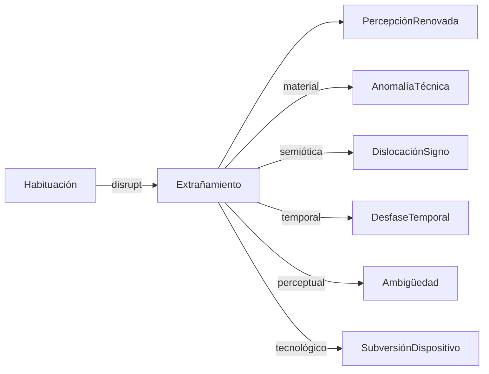

Según Viktor Shklovsky, el arte tiene como función impedir que la percepción se vuelva habitual, devolviéndole a las cosas su capacidad de ser vistas o escuchadas como si fuera la primera vez. El extrañamiento no es simplemente sorprender, sino reformar los medios de percepción:

“El propósito del arte es impartir la sensación de cosas como son percibidas y no como son conocidas. La técnica del arte es hacer ‘las cosas raras’, hacer formas difíciles, aumentar la dificultad y duración de la percepción.”
— Shklovsky, 1917

(remitencia y suspensión de las herramientas
que remiten al mundo del trabajo, pero lo suspenden entre
ritmo frenético y silenciosa inactividad).

## Dimensiones del Extrañamiento

Es posible entender el extrañamiento como un vector multidimensional que opera en distintas capas de la obra:

### a. Material
	Uso no convencional del instrumento (extended techniques)
	Sonoridades inauditas, materiales inusuales
	Artefactos, errores y ruido como material compositivo

### b. Temporal
	Disrupción de la linealidad narrativa
	Repetición, bucles, asincronía, tiempo suspendido

### c. Espacial
	Deslocalización del sonido: altavoces ocultos, distribución escénica
	Interacción performática con el espacio no teatral

### d. Perceptual
	Ambigüedad figura-fondo
	Saturación o vacío sensorial
	Trabajo con límites de percepción (infrasonido, ultrasonido, microtonos)

### e. Semiótica
	Quiebre de convenciones idiomáticas
	Recontextualización de signos (collage, citas irónicas, apropiacionismo)
	Uso de lenguajes no musicales en música (voz hablada, lenguas inventadas)

### f. Tecnológica
	Reprogramación de interfaces (glitch, hackeo sonoro)
	Medios obsoletos o híbridos (cassettes, radio de onda corta, circuit bending)

# referencias
Viktor Shklovsky (1917) – origen del concepto de ostranenie
Bertolt Brecht – Verfremdungseffekt (efecto de distanciamiento en teatro)
Susan Sontag – Against Interpretation (contra la reducción del arte a significado)
John Cage – silencio, azar, y reconfiguración perceptual
Luciano Berio – Sinfonia como collage semiótico
Helmut Lachenmann – musique concrète instrumentale, lo técnico como poético
Salomé Voegelin – Listening to Noise and Silence, estética de la escucha no representacional
Brian Eno – ambient, desautomatización espacial
Jacques Rancière – lo sensible como política, redistribución de lo visible/decible

# ejemplos de aplicación 
1.	Diseño de interfaces que resisten el hábito: instrumentos que no se dejan dominar fácilmente. (obfuscación)
2.	Ambientes performáticos anti-espectaculares: que inviten al silencio o la contemplación sin foco.(austeridad, minimalismo)
3.	Formas inestables: obras que cambian con cada escucha (algoritmos, IA, entornos reactivos). (generatividad, adaptabilidad)
4.	Interrupción de la continuidad histórica: uso de tecnologías anacrónicas (gramófonos, cintas). (disnovación, )
5.	Uso de lo no-músico: habla tartamuda, respiraciones, objetos cotidianos amplificados.

# obras de referencia

## Nicolás Bacal
https://nicolasbacal.com/la-medida-de-mi-tiempo

Remitencia y suspension de las herramientas que remiten al 
mundo del trabajo, pero lo suspenden entre ritmo rallentado  y silenciosa inactividad.

