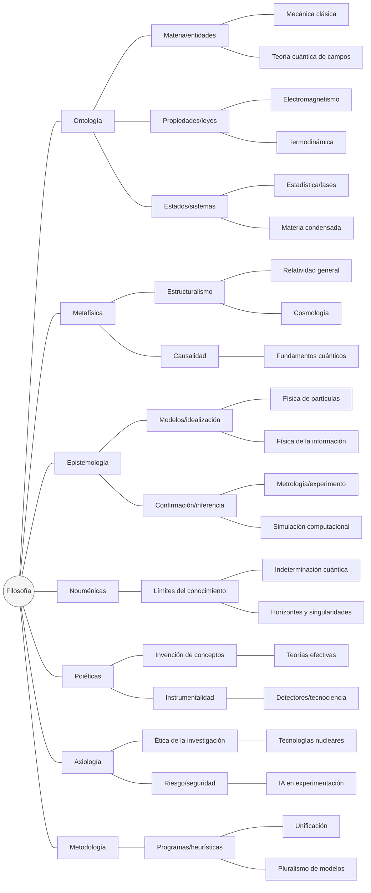

# física de partículas 

Entre las teorías que nombra [[John Barrows]]





1.	Ontología se conecta con preguntas sobre qué existe en la física: sistemas, propiedades, leyes; de allí se despliegan mecánica clásica, campos cuánticos, termodinámica y materia condensada como realizaciones ontológicas diferenciadas.

2.	Metafísica encuadra compromisos sobre estructura del mundo y causalidad; relatividad, cosmología y fundamentos cuánticos heredan esos compromisos.

3.	Epistemología organiza cómo conocemos: modelos, confirmación, medición, simulación; allí se ubican partículas, información y prácticas experimentales.

4.	Nouménicas marca límites del conocer: indeterminación, horizontes, singularidades.

5.	Poiéticas subraya la producción de teoría e instrumentación como creación técnica: teorías efectivas, detectores.

6.	Axiología introduce valores, riesgos y ética de investigación.

7.	Metodología articula programas de investigación, unificación y pluralismo.


```bibtex
@book{Aristotle1998,
  author = {Aristotle},
  year = {1998},
  title = {Metaphysics},
  publisher = {Penguin},
  pages = {I.1--I.2}
}

@book{Kant1998,
  author = {Kant, Immanuel},
  year = {1998},
  title = {Critique of Pure Reason},
  publisher = {Cambridge University Press},
  editor = {Guyer, Paul and Wood, Allen W.},
  pages = {A249--A260}
}

@book{Bunge2006,
  author = {Bunge, Mario},
  year = {2006},
  title = {Philosophy of Physics},
  publisher = {Springer},
  pages = {1--25}
}

@book{LadymanRoss2007,
  author = {Ladyman, James and Ross, Don},
  year = {2007},
  title = {Every Thing Must Go: Metaphysics Naturalized},
  publisher = {Oxford University Press},
  pages = {121--170}
}

@book{vanFraassen1980,
  author = {van Fraassen, Bas C.},
  year = {1980},
  title = {The Scientific Image},
  publisher = {Oxford University Press},
  pages = {56--75}
}

@book{Cartwright1983,
  author = {Cartwright, Nancy},
  year = {1983},
  title = {How the Laws of Physics Lie},
  publisher = {Oxford University Press},
  pages = {1--30}
}

@book{Hacking1983,
  author = {Hacking, Ian},
  year = {1983},
  title = {Representing and Intervening},
  publisher = {Cambridge University Press},
  pages = {132--172}
}

@book{Cassirer1923,
  author = {Cassirer, Ernst},
  year = {1923},
  title = {Substance and Function},
  publisher = {Open Court},
  pages = {286--310}
}

@book{FriggHartmann2018,
  author = {Frigg, Roman and Hartmann, Stephan},
  year = {2018},
  title = {Models in Science},
  publisher = {Stanford Encyclopedia of Philosophy},
  pages = {§2--§4}
}

@book{Butterfield2014,
  author = {Butterfield, Jeremy},
  year = {2014},
  title = {On the Emergence of Time in Quantum Gravity},
  publisher = {Cambridge University Press},
  pages = {43--68}
}
```
